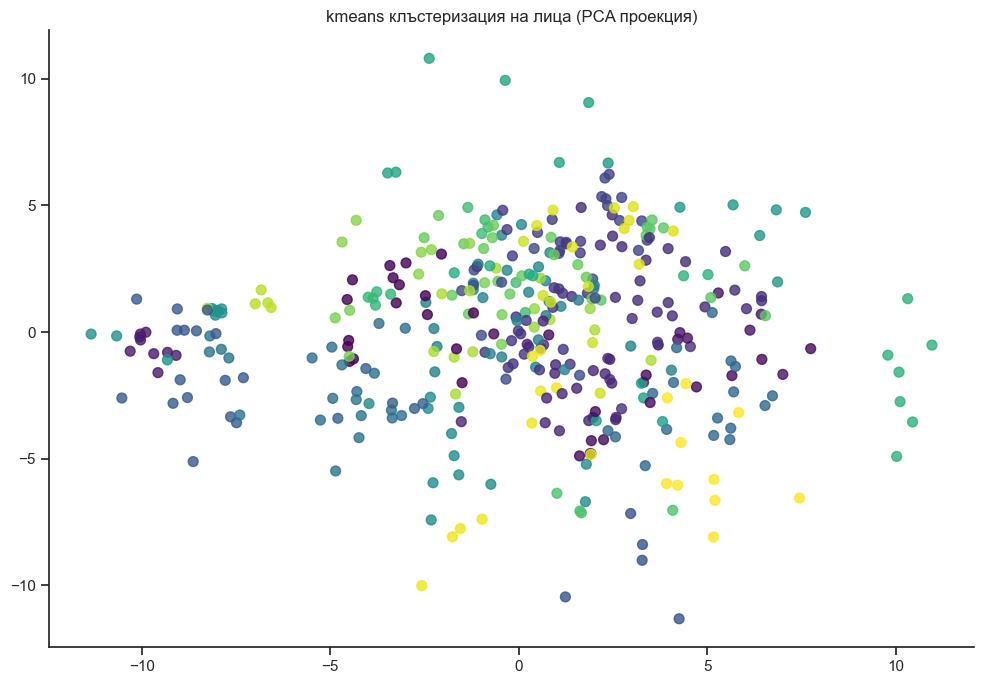

```python
import numpy as np
import matplotlib.pyplot as plt
from sklearn.datasets import make_blobs, make_moons, fetch_olivetti_faces
from sklearn.cluster import KMeans, AgglomerativeClustering
from sklearn.metrics import silhouette_score
from sklearn.preprocessing import StandardScaler
from sklearn.metrics import DistanceMetric
from scipy.spatial.distance import pdist, squareform
import seaborn as sns
from matplotlib.colors import ListedColormap
import pandas as pd
from time import time

plt.style.use('seaborn-v0_8-whitegrid')
custom_params = {"axes.spines.right": False, "axes.spines.top": False}
sns.set_theme(style="ticks", rc=custom_params)

def generate_datasets():
    # Обикновени клъстери
    X_blobs, y_blobs = make_blobs(n_samples=300, centers=4, 
                                  cluster_std=0.60, random_state=42)
    
    # Нелинейни клъстери
    X_moons, y_moons = make_moons(n_samples=300, noise=0.08, random_state=42)
    
    # Анизотропни клъстери
    transformation = [[0.60, -0.60], [-0.40, 0.80]]
    X_aniso = np.dot(X_blobs, transformation)
    y_aniso = y_blobs
    
    # Клъстери с различна плътност
    X_varied, y_varied = make_blobs(n_samples=300, centers=3, 
                                    cluster_std=[1.0, 2.5, 0.5], random_state=42)
    
    return {
        "blobs": (X_blobs, y_blobs),
        "moons": (X_moons, y_moons),
        "anisotropic": (X_aniso, y_aniso),
        "varied": (X_varied, y_varied)
    }

def plot_clusters(X, y_pred, y_true=None, title="Клъстери"):
    plt.figure(figsize=(10, 7))
    
    cmap = ListedColormap(['#1f77b4', '#ff7f0e', '#2ca02c', '#d62728', 
                           '#9467bd', '#8c564b', '#e377c2', '#7f7f7f'])
    
    plt.scatter(X[:, 0], X[:, 1], c=y_pred, cmap=cmap, marker='o', s=50, alpha=0.8)
    
    if y_true is not None:
        plt.figure(figsize=(5, 3.5))
        plt.scatter(X[:, 0], X[:, 1], c=y_true, cmap=cmap, marker='o', s=50, alpha=0.8)
        plt.title(f"Истински клъстери за {title}")
    
    plt.title(title)
    plt.tight_layout()
    plt.show()

def euclidean_distance(x, y):
    return np.sqrt(np.sum((x - y) ** 2))

def manhattan_distance(x, y):
    return np.sum(np.abs(x - y))

def chebyshev_distance(x, y):
    return np.max(np.abs(x - y))

def minkowski_distance(x, y, p=3):
    return np.power(np.sum(np.power(np.abs(x - y), p)), 1/p)

# пример с хексагонална метрика
def hexagonal_distance(x, y):
    dx = abs(x[0] - y[0])
    dy = abs(x[1] - y[1])
    return max(dx, dy) if dx == dy else dx + dy

# 4. Клъстеризация с K-means и Агломеративна клъстеризация
def perform_clustering(X, n_clusters=4):
    # K-means с Евклидово разстояние (стандартно)
    kmeans = KMeans(n_clusters=n_clusters, random_state=42, n_init=10)
    t0 = time()
    y_kmeans = kmeans.fit_predict(X)
    kmeans_time = time() - t0
    
    # Агломеративна клъстеризация с различни метрики
    metrics = {
        'euclidean': 'euclidean',
        'manhattan': 'manhattan', 
        'cosine': 'cosine',
        'chebyshev': 'chebyshev'
    }
    
    results = {'kmeans': (y_kmeans, kmeans_time)}
    
    for name, metric in metrics.items():
        t0 = time()
        agglo = AgglomerativeClustering(n_clusters=n_clusters, linkage='ward' if metric == 'euclidean' else 'complete',
                                        metric=metric)
        y_agglo = agglo.fit_predict(X)
        agglo_time = time() - t0
        results[f'agglo_{name}'] = (y_agglo, agglo_time)
    
    return results

# Оценка на клъстеризацията с различни метрики
def evaluate_clustering(X, clustering_results):
    scores = []
    
    for name, (y_pred, runtime) in clustering_results.items():
        if len(np.unique(y_pred)) > 1:  # Проверка дали има повече от 1 клъстер
            silhouette = silhouette_score(X, y_pred)
        else:
            silhouette = float('nan')
            
        scores.append({
            'Алгоритъм': name,
            'Силует скор': silhouette,
            'Време (секунди)': runtime
        })
    
    return pd.DataFrame(scores)

# Експериментиране с различни метрики върху различни наборове от данни
def run_complete_analysis():
    datasets = generate_datasets()
    
    for dataset_name, (X, y_true) in datasets.items():
        print(f"\n=== Анализ на набор от данни: {dataset_name} ===")
        
        n_clusters = len(np.unique(y_true))
        
        clustering_results = perform_clustering(X, n_clusters)
        
        scores_df = evaluate_clustering(X, clustering_results)
        print("\nРезултати от клъстеризацията:")
        print(scores_df.to_string(index=False))
        
        for name, (y_pred, _) in clustering_results.items():
            plot_clusters(X, y_pred, y_true, 
                         f"{name} клъстеризация на {dataset_name}")

# Приложение върху реални данни
def analyze_real_data():
    faces = fetch_olivetti_faces()
    X = faces.data
    y_true = faces.target
    
    fig, axes = plt.subplots(2, 5, figsize=(10, 4),
                           subplot_kw={'xticks': [], 'yticks': []})
    for i, ax in enumerate(axes.flat):
        ax.imshow(faces.images[i], cmap='gray')
    plt.suptitle('Примерни лица от базата данни Olivetti')
    plt.tight_layout()
    plt.show()
    
    from sklearn.decomposition import PCA
    pca = PCA(n_components=2, random_state=42)
    X_pca = pca.fit_transform(X)
    
    n_clusters = len(np.unique(y_true))
    print(f"Брой на истинските лица (хора): {n_clusters}")
    
    # K-means
    kmeans = KMeans(n_clusters=n_clusters, random_state=42, n_init=10)
    y_kmeans = kmeans.fit_predict(X)
    
    metrics = {
        'euclidean': 'euclidean',
        'manhattan': 'manhattan', 
        'cosine': 'cosine'
    }
    
    results = {'kmeans': y_kmeans}
    
    for name, metric in metrics.items():
        agglo = AgglomerativeClustering(n_clusters=n_clusters, 
                                        linkage='ward' if metric == 'euclidean' else 'complete',
                                        metric=metric)
        results[f'agglo_{name}'] = agglo.fit_predict(X)
    
    for name, y_pred in results.items():
        plt.figure(figsize=(10, 7))
        plt.scatter(X_pca[:, 0], X_pca[:, 1], c=y_pred, 
                   cmap='viridis', marker='o', s=50, alpha=0.8)
        plt.title(f"{name} клъстеризация на лица (PCA проекция)")
        plt.tight_layout()
        plt.show()
        
        silhouette = silhouette_score(X, y_pred)
        print(f"Силует скор за {name}: {silhouette:.4f}")
    
    plt.figure(figsize=(10, 7))
    plt.scatter(X_pca[:, 0], X_pca[:, 1], c=y_true, 
               cmap='viridis', marker='o', s=50, alpha=0.8)
    plt.title("Истински класове на лица (PCA проекция)")
    plt.tight_layout()
    plt.show()

# Изследване на ефекта от инициализацията на K-means
def explore_kmeans_initialization(X, n_clusters=4, n_init_values=[1, 5, 10, 20]):
    results = []
    
    for n_init in n_init_values:
        silhouette_scores = []
        runtimes = []
        
        for i in range(10):
            kmeans = KMeans(n_clusters=n_clusters, n_init=n_init, random_state=i)
            t0 = time()
            labels = kmeans.fit_predict(X)
            runtime = time() - t0
            
            silhouette = silhouette_score(X, labels)
            silhouette_scores.append(silhouette)
            runtimes.append(runtime)
        
        results.append({
            'n_init': n_init,
            'mean_silhouette': np.mean(silhouette_scores),
            'std_silhouette': np.std(silhouette_scores),
            'mean_runtime': np.mean(runtimes)
        })
    
    results_df = pd.DataFrame(results)
    print("\nВлияние на параметъра n_init върху K-means:")
    print(results_df.to_string(index=False))
    
    plt.figure(figsize=(10, 6))
    plt.errorbar(results_df['n_init'], results_df['mean_silhouette'], 
                yerr=results_df['std_silhouette'], marker='o', linestyle='-')
    plt.xlabel('Брой инициализации (n_init)')
    plt.ylabel('Среден силует скор')
    plt.title('Влияние на броя инициализации върху качеството на K-means')
    plt.tight_layout()
    plt.show()

# Изпълнение на всички анализи
if __name__ == "__main__":
    datasets = generate_datasets()
    
    print("Визуализация на генерираните набори от данни:")
    for name, (X, y) in datasets.items():
        plt.figure(figsize=(8, 6))
        plt.scatter(X[:, 0], X[:, 1], c=y, cmap='viridis', s=50, alpha=0.8)
        plt.title(f"Набор от данни: {name}")
        plt.tight_layout()
        plt.show()
    
    run_complete_analysis()
    
    print("\nИзследване на влиянието на инициализацията на K-means:")
    explore_kmeans_initialization(datasets['blobs'][0])
    
    print("\nПриложение върху реални данни (лица):")
    analyze_real_data()
```

    Визуализация на генерираните набори от данни:
    


    

    


    

    


    

    


    

    


    
    === Анализ на набор от данни: blobs ===
    
    Резултати от клъстеризацията:
          Алгоритъм  Силует скор  Време (секунди)
             kmeans     0.875647         0.578998
    agglo_euclidean     0.875647         0.006998
    agglo_manhattan     0.875647         0.004001
       agglo_cosine     0.875647         0.005001
    agglo_chebyshev     0.875647         0.004996
    


    

    


    

    


    

    


    

    


    

    


    

    


    

    


    

    


    

    


    

    


    
    === Анализ на набор от данни: moons ===
    
    Резултати от клъстеризацията:
          Алгоритъм  Силует скор  Време (секунди)
             kmeans     0.483590         0.031008
    agglo_euclidean     0.427308         0.017991
    agglo_manhattan     0.445060         0.007000
       agglo_cosine     0.427981         0.004000
    agglo_chebyshev     0.425600         0.003996
    


    

    


    

    


    

    


    

    


    

    


    

    


    

    


    

    


    

    


    

    


    
    === Анализ на набор от данни: anisotropic ===
    
    Резултати от клъстеризацията:
          Алгоритъм  Силует скор  Време (секунди)
             kmeans     0.769653         0.032010
    agglo_euclidean     0.769653         0.013994
    agglo_manhattan     0.769653         0.006998
       agglo_cosine     0.701871         0.006008
    agglo_chebyshev     0.769653         0.003993
    


    

    


    

    


    

    


    

    


    

    


    

    


    

    


    

    


    

    


    

    


    
    === Анализ на набор от данни: varied ===
    
    Резултати от клъстеризацията:
          Алгоритъм  Силует скор  Време (секунди)
             kmeans     0.787119         0.028002
    agglo_euclidean     0.782961         0.017001
    agglo_manhattan     0.782961         0.009001
       agglo_cosine     0.781283         0.003996
    agglo_chebyshev     0.675626         0.005999
    


    

    


    

    


    

    


    

    


    

    


    

    


    

    


    

    


    

    


    

    


    
    Изследване на влиянието на инициализацията на K-means:
    
    Влияние на параметъра n_init върху K-means:
     n_init  mean_silhouette  std_silhouette  mean_runtime
          1         0.875647    1.110223e-16      0.005200
          5         0.875647    1.110223e-16      0.014474
         10         0.875647    1.110223e-16      0.023161
         20         0.875647    1.110223e-16      0.041324
    


    

    


    
    Приложение върху реални данни (лица):
    


    

    


    Брой на истинските лица (хора): 40
    


    

    


    Силует скор за kmeans: 0.1465
    


    

    


    Силует скор за agglo_euclidean: 0.1617
    


    

    


    Силует скор за agglo_manhattan: 0.1320
    


    

    


    Силует скор за agglo_cosine: 0.0910
    


    

    


```python

```
